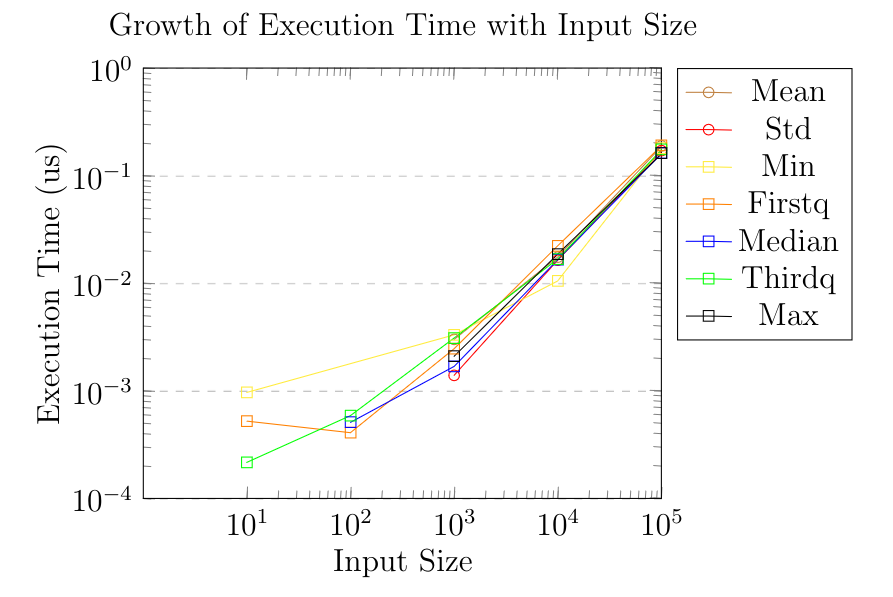

M. Eymen Ünay\

*Istanbul Technical University - BLG 335E Analysis of Algorithms I - Assignment II*

*This assignment received full grade out of 100.*

# Introduction

The assignment's requirement is to process a stream of numbers and
evaluate statistics. As the assignment states it, an incremental
approach to evaluation is embraced rather than analysing the whole input
file beforehand. As every statistical feature can be deactivated at the
beginning of the input file, modularity at evaluation of each
statistical value is preserved. This modularity caused several similar
data structures and similar calls to these structures but the ease of
maintenance and deactivation ability made me favour a more modular
approach.

# Code Internals

## Data Structures

To store which statistical values are desired at output a struct with
every value corresponding to a bool is created and checked throughout
the code to prevent unnecessary calculations or writes.

Every statistical value and their companions are stored in their
corresponding struct in a global data_structures struct. Additional to
their own values, the structs contain companion structures. Std has all
the relevant data in a vector which it computes with. Each of median,
firstq and thirdq has two heaps, a max and min heap. Quartiles have 3:1
size ratios of heaps and median has 1:1 size ratio.

## Functions

To optimize for performance, costly operations such as sorting is
avoided and instead heaps are used to take the load of storing minimum
and maximums of regions of interest. Functions about heap are in heap.h.

The worst case recurrence relation of a Max_heapify function with
pseudocode at Algorithm 1, is $T(n) <= T(2n/3) + \Theta(1)$. Using
Case 2 of Master Method $T(n) = O(lg n)$

```pseudocode
Algorithm 1: Max heapify

Maxheap M

function Max_heapify(M, i):
    l ← Left(i)
    r ← Right(i)
    largest ← i
    
    # if left child is larger make it the largest
    if (l ≤ heap_size and A[l] > A[i]):
        largest ← l
    else:
        largest ← i
    
    # if right child is larger make it the largest
    if (r ≤ heap_size and A[r] > A[largest]):
        largest ← r
    
    # if one of the childs were larger
    if largest ≠ i:
        Swap(A[i], A[largest])  # swap largest child with index at parent
        Max_heapify(A, largest)  # recursive call to itself from child

```

The Algorithm 2 provides the ability to build a heap
from an unsorted array though it is not used as every heap is built from
scratch. Its asymptotic bound is $O(n)$.

```pseudocode
Algorithm 2: Build_Max_Heap

Array A

function Build_Max_Heap(A):
    heap_size ← Length(A)
    
    # Runs from the parents with children
    for i ← Floor(Length(A)/2) downto 1:
        Max_heapify(A, i)
```

The Algorithm 3 returns the root node and deletes it
at the heap. Calls Algorithm 1 to restore the heap property. Its analysis
is similar to Algorithm 1 since the remaining code adds constant
complexity.

```pseudocode
Algorithm 3: Extract_Max_Heap

Heap M

function Extract_Max_Heap(A):
    max ← M[1]  # Root node
    M[1] ← M[heap_size]  # last element becomes the root
    heap_size--
    Pop_back(M)  # last element deleted
    Max_Heapify(M, 1)
    return max
```

# Application of Data Structures

There are two classes which coordinate and operate on the required
inputs: Stats class which has the calculate functions and Manager class
which coordinates when to call calculate and adds new data to the
corresponding data structures.

When new data arrives add_element function of Manager runs and checks
which options are set. Accordingly, runs calculate functions of mean
std, renews min and max, adds data to std's vector and adds elements to
heaps of order statistical values. After adding data to vector and heaps
their corresponding statistical calculation functions at Stats are
called.

Double heap structures for order statistics is used. To implement
median, two cases are checked. If sizes of heaps are equal, new element
is added to max heap and the heap gets sifted which updates the min
heap. The case for different size is similar with the direction in
reverse. To calculate median sizes are checked and returned from max or
interpolated accordingly.

Achieving similar structure at quartiles requires 4 states to check but
is similar to median in essence. The calculate function uses Gumbel
quartile interpolation according to new states after the element is
added.

# Performance Analysis

To minimise the effects of standard deviation and mean calculations,
Welford's online algorithm is used. Compared to naive implementation, it
reduced the growth complexity close to $O(logn)$ as it can be estimated
from the plot below referring heap based order calculation complexities.



To observe the callgraph and call frequency check [here](./res/call_profile.png).

# Discussion

Using a sliding window based method is possible since instead of waiting
for the data to arrive and accumulate it, we could move over the data
and calculate accordingly. Irrelevant parts of data structures could be
pruned which is not possible at a sorting based approach.

Though heaps provided immense speed in finding the quartiles and the
median, it seemed redundant to use three pairs of heaps to provide
related information about the same data. Though the memory complexity is
constantly growing, if the memory would like to be optimised against
speed an approach combining all three structures is possible. The
structure requires a special type of heap called min-max heap which is a
heap slightly more complicated to use but stores both min and max of the
data. By using this heap it is possible to find the first quartile,
median and third quartile from a single entity. To build the structure
it would be needed to have 4 heaps of same size. From the minimum to the
first quartile of the data can be stored in a max heap and the data from
the maximum of data to its third quartile can be stored in the min heap.
For the remaining two heaps it would be needed to use the minmax heap
discussed above to use the same heaps for both median and its
neighbouring quartile. Some implementation of minmax heap can be found
in my heap.h file. The problem with this structure is that the addition
of elements and the state protection have to be thought thoroughly. A
sift in one heap may trigger the next heap to sift. To sum up, less
memory can be used by having a more complicated data structure and
management system.
